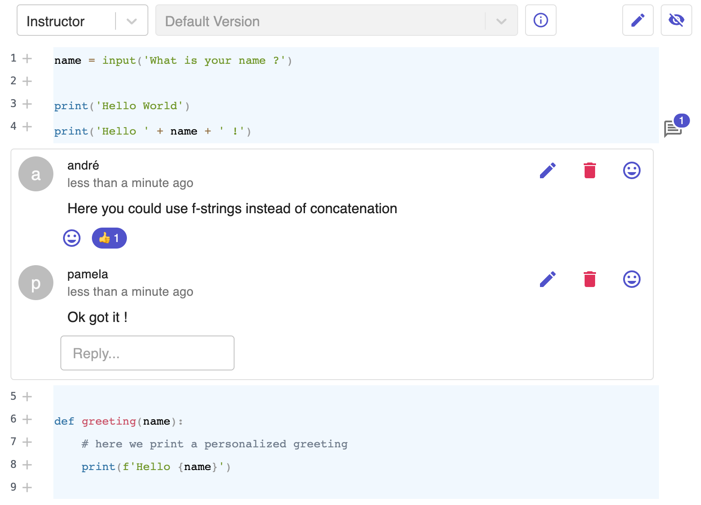

<p align="center">
  <a href="https://graasp.eu/">
    
  </a>
</p>

# Graasp App: Code Review



The Graasp Code Review App lets users review code snippets as can be done on social coding platforms like GitHub, Gitlab or Bitbucket.

### Features

- Viewing code set up by the instructor
- Adding comments to code lines
- Responding to comments in threads
- Responding to comments with Reactions (emojis)
- Interacting with bots
- Replying to bots using quick replies
- Asking for help from a human when bot answer is unclear
- Reporting comments
- Submitting new code snippets

### Upcomming Features

- Diff view

### Available Languages

- English
- French

## Running Locally

To install the dependancies:

```
yarn
```

To run the app locally:

```
yarn start
```

This will start the app as well as a dev server to use as a backend.
